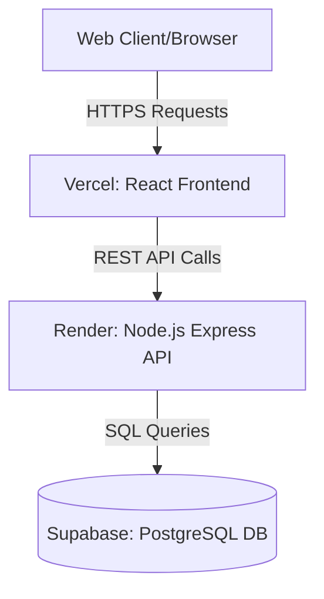

# Name: XXX
# Registration Number: XXX

# Custom Developer CMS

A custom blogging and portfolio platform built with a modern decoupled client-server architecture.

## System Architecture & Tech Stack
- **Frontend**: React, styled with Tailwind CSS (Deployed on Vercel)
- **Backend**: Node.js with Express, structured using RESTful principles (Deployed on Render/Railway)
- **Database**: PostgreSQL (Hosted on Supabase)

## Architecture Diagram

## Setup Instructions

### Database (Supabase)
1. Execute the `database/schema.sql` script in your Supabase SQL editor to create the `posts` table.

### Backend
1. Navigate to the `backend` directory.
2. Run `npm install` to install dependencies.
3. Create a `.env` file with `PORT`, `SUPABASE_URL`, and `SUPABASE_KEY`.
4. Run `npm run dev` to start the server.

### Frontend
1. Navigate to the `frontend` directory.
2. Run `npm install` to install dependencies.
3. Create a `.env` file with `REACT_APP_API_URL=http://localhost:5000/api`.
4. Run `npm start` to start the React application.
